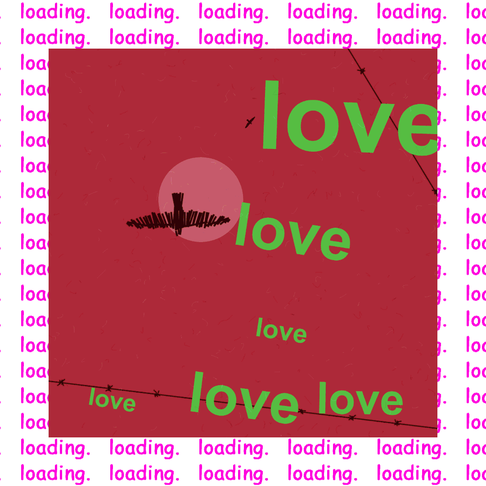

<h1>What is genArtPoster?</h1>

https://neuromodern.github.io/genArtPoster/ - try online

genArtPoster is an avant-garde machine that generates random art posters, each featuring a unique composition of lines, shapes, and phrases. Inspired by the bold typography and graphic style of classic modern era propaganda, this project uses generative algorithms to create an endless variety of visually striking and intellectually stimulating artworks.

